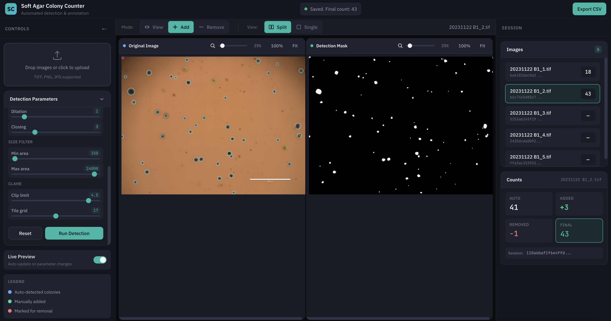

# Soft Agar Colony Counter

Automated colony counting for soft agar assays. Upload your images, adjust detection parameters with live preview, manually add or remove colonies as needed, and export your counts to CSV.



---

## Citation

If you use Soft Agar Colony Counter in a publication, please cite:

> Sarfaraz, N. (2025). *Soft Agar Colony Counter* (Version 0.1.0) [Software].
> https://github.com/Nima-Sarfaraz/Soft-Agar-Colony-Counter

BibTeX:

```bibtex
@software{sarfaraz2025softagar,
  author  = {Sarfaraz, Nima},
  title   = {Soft Agar Colony Counter},
  year    = {2025},
  version = {0.1.0},
  url     = {https://github.com/Nima-Sarfaraz/Soft-Agar-Colony-Counter}
}
```
---
## Installation Guide

Choose the method that works best for you. **Option 1 (Python Script)** is recommended for most users.

### Option 1: Python Script (Recommended)

This method uses a simple script that sets everything up automatically.

#### Step 1: Install Python

You need Python 3.10 or newer installed on your computer.

<details>
<summary><strong>macOS</strong></summary>

1. Open **Terminal** (press `Cmd + Space`, type "Terminal", press Enter)
2. Check if Python is installed by typing: `python3 --version`
3. If not installed, download from [python.org/downloads](https://www.python.org/downloads/) and run the installer
4. During installation, check the box that says "Add Python to PATH"

</details>

<details>
<summary><strong>Windows</strong></summary>

1. Download Python from [python.org/downloads](https://www.python.org/downloads/)
2. Run the installer
3. **Important:** Check the box that says "Add Python to PATH" before clicking Install
4. Click "Install Now"

</details>

<details>
<summary><strong>Linux (Ubuntu/Debian)</strong></summary>

Open a terminal and run:
```bash
sudo apt update
sudo apt install python3 python3-pip python3-venv
```

</details>

#### Step 2: Download the Software

**Option A: Download ZIP (easiest)**
1. Click the green **Code** button at the top of this page
2. Click **Download ZIP**
3. Extract the ZIP file to a folder (e.g., your Desktop or Documents)

**Option B: Using Git (if you have it installed)**
```bash
git clone https://github.com/Nima-Sarfaraz/Soft-Agar-Colony-Counter.git
```

#### Step 3: Run the Application

<details>
<summary><strong>macOS / Linux</strong></summary>

1. Open **Terminal**
2. Navigate to the folder where you extracted the files:
   ```bash
   cd ~/Desktop/Soft-Agar-Colony-Counter
   ```
   (adjust the path if you put it somewhere else)
3. Make the script executable (first time only):
   ```bash
   chmod +x start.sh
   ```
4. Run the application:
   ```bash
   ./start.sh
   ```
5. Your browser will open automatically to the app

</details>

<details>
<summary><strong>Windows</strong></summary>

1. Open the folder where you extracted the files
2. Double-click **`start.bat`**
3. A command window will open and set things up (this may take a minute the first time)
4. Your browser will open automatically to the app

**Alternative:** If double-clicking doesn't work:
1. Press `Win + R`, type `cmd`, press Enter
2. Navigate to the folder:
   ```
   cd C:\Users\YourName\Desktop\Soft-Agar-Colony-Counter
   ```
3. Run: `start.bat`

</details>

The script automatically:
- Creates an isolated Python environment
- Installs all dependencies
- Starts the server
- Opens your web browser to the app

**To stop the application:** Press `Ctrl + C` in the terminal/command window.

---

### Option 2: Docker (Alternative)

Docker is a containerization platform that packages the app with all its dependencies. This is useful if you're familiar with Docker or want complete isolation.

#### Step 1: Install Docker

1. Download and install [Docker Desktop](https://www.docker.com/products/docker-desktop/)
2. Start Docker Desktop and wait for it to fully load

#### Step 2: Run with Docker

Open a terminal/command prompt in the project folder and run:
```bash
docker compose up
```

Then open http://localhost:8000 in your browser.

**To stop:** Press `Ctrl + C` in the terminal.

---

## How to Use

Once the application is running in your browser:

1. **Upload Images** — Drag and drop your TIFF, PNG, or JPG files into the upload area (or click to browse)
2. **Adjust Parameters** — Use the sliders on the left to tune detection sensitivity. Changes preview live.
3. **Review & Edit** — Switch between View/Add/Remove modes to manually correct any missed or false colonies
4. **Export Results** — Click "Export CSV" to download a spreadsheet with colony counts for all images

**Tips:**
- Use the **Split View** to see both your image and the detection mask side-by-side
- The mask shows what the algorithm "sees" — white regions are potential colonies
- Parameters are saved per-image, so you can tune each one individually

---

## Security Notice

This project takes supply-chain security seriously. In light of recent npm ecosystem
attacks (e.g., Shai-Hulud), we've implemented several protective measures:

### Recommended Deployment Methods (Safest First)

1. **One-Click Script** (Recommended): Uses pre-built frontend and creates isolated Python venv
2. **Pre-built frontend**: The `frontend/dist/` directory is committed to git, so non-Node users can run immediately
3. **Docker**: Runs in an isolated container (convenient for container workflows)
4. **Local build**: Uses `npm ci` for deterministic installs from lockfile

### Security Measures Implemented

- **Locked dependencies**: All npm packages pinned to exact versions
- **Deterministic installs**: Start scripts use `npm ci` (not `npm install`)
- **Install scripts disabled**: `frontend/.npmrc` sets `ignore-scripts=true`
- **Local-only binding**: Server binds to `127.0.0.1` by default

### For Developers Building from Source

When building the frontend locally, be aware that `npm ci` will download and
install ~250 third-party packages. While we've taken precautions:

- Review the `package-lock.json` if you have concerns
- Consider building in a container or VM for isolation
- Avoid storing sensitive credentials in environment variables during builds
- The pre-built `frontend/dist/` avoids npm entirely if you prefer

For more information on npm supply-chain security, see:
[Snyk's npm security guide](https://snyk.io/blog/ten-npm-security-best-practices/)

---

## Features

- **Web UI:** Browser-based interface with drag-and-drop upload, live parameter tuning, and manual annotation
- **CLI:** Batch processing for automated workflows
- **FastAPI Backend:** REST API for programmatic access

## Architecture Overview

- **Engine (`softagar.engine`)** – OpenCV/NumPy pipeline that accepts in-memory
  images and returns colony metadata (counts, coordinates, masks).
- **CLI (`softagar.cli`)** – Batch processing front-end that walks folders,
  calls the engine, and writes CSV summaries.
- **API (`api.main`)** – FastAPI service that wraps uploads, detection, manual
  annotations, and CSV export for web clients.
- **Web UI (`frontend/`)** – React + Konva.js browser interface.

## Installation (Developer)

### Pip (recommended)
```bash
python -m venv .venv
source .venv/bin/activate
pip install -e .
```

Alternatively, install the exact pinned runtime stack (core + API extras) with:
```bash
pip install -r requirements.txt
```

### With optional FastAPI (API) extras
```bash
pip install -e ".[api]"
```

### Conda users
```bash
conda create -n softagar python=3.11 pip
conda activate softagar
pip install -e ".[api]"
```

## CLI Quickstart

```bash
softagar count \
  --input examples/data/HepG2 \
  --output results.csv \
  --recursive \
  --global-thresh 120 \
  --min-area 400 \
  --max-area 12000
```

- Input can be a single file or a folder.
- Use `--recursive` to scan nested directories.
- All detection parameters are surfaced as flags; omit them to stick with
  sensible defaults (`softagar.cli` mirrors `softagar.engine.detect_colonies`).

## Web UI

The web interface provides:
- Drag-and-drop image upload (supports TIFF, PNG, JPG)
- Interactive parameter tuning with live preview
- Click to add/remove colonies manually
- CSV export of final counts

### Running the Web UI (Development)

```bash
# Terminal 1: Start the API
pip install -e ".[api]"
uvicorn api.main:app --reload --port 8000

# Terminal 2: Start the frontend dev server
cd frontend
npm install
npm run dev
```

Visit http://localhost:5173 (dev) or http://localhost:8000 (production build).

### API Endpoints (for automation)

- `POST /upload` – Upload images, returns session_id and image_ids
- `POST /process/{image_id}` – Run detection with parameters
- `POST /annotations/{image_id}` – Save manual edits
- `GET /results/{session_id}` – Download CSV

## Example Data

`examples/data/` contains sample HepG2 and Huh7 plate images for testing and demos.
See `examples/README.md` for CLI workflow tutorials.

## Citation

If you use Soft Agar Colony Counter in a publication, please cite:

> Sarfaraz, N. (2025). *Soft Agar Colony Counter* (Version 0.1.0) [Software].
> https://github.com/Nima-Sarfaraz/Soft-Agar-Colony-Counter

BibTeX:

```bibtex
@software{sarfaraz2025softagar,
  author  = {Sarfaraz, Nima},
  title   = {Soft Agar Colony Counter},
  year    = {2025},
  version = {0.1.0},
  url     = {https://github.com/Nima-Sarfaraz/Soft-Agar-Colony-Counter}
}
```

## Repository Layout

```
Colony_Counter/
├── softagar/           # Python engine, CLI, IO helpers
├── api/                # FastAPI backend
├── frontend/           # React + Vite web interface
├── examples/           # Sample images and tutorials
├── tests/              # Unit tests
├── assets/             # Screenshots
├── Dockerfile          # Container build
├── docker-compose.yml  # One-command startup
├── start.sh            # macOS/Linux launcher
├── start.bat           # Windows launcher
├── pyproject.toml      # Python packaging
├── LICENSE             # MIT license
└── README.md
```

## Troubleshooting

**Port already in use:**
```bash
# Find and kill the process using port 8000
lsof -i :8000
kill -9 <PID>
```

**Docker build fails:**
- Ensure Docker Desktop is running
- Try `docker compose build --no-cache`

**Frontend not loading:**
- Check that `frontend/dist/` exists (run `cd frontend && npm run build`)
- Or use the dev server: `cd frontend && npm run dev`

**Python dependency issues:**
```bash
# Clean reinstall
rm -rf .venv
python3 -m venv .venv
source .venv/bin/activate
pip install -e ".[api]"
```

## Contributing

See `CONTRIBUTING.md` for development workflow, coding standards, and release
process. We welcome bug reports, feature requests, and pull requests!

## License

MIT License - see [LICENSE](LICENSE) for details.
